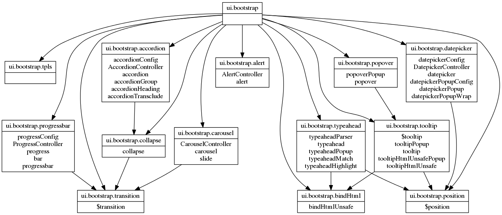

# grunt-angular-modules-graph

> Generate modules dependencies graph in .dot format

## Getting Started
This plugin requires Grunt `~0.4.2`

If you haven't used [Grunt](http://gruntjs.com/) before, be sure to check out the [Getting Started](http://gruntjs.com/getting-started) guide, as it explains how to create a [Gruntfile](http://gruntjs.com/sample-gruntfile) as well as install and use Grunt plugins. Once you're familiar with that process, you may install this plugin with this command:

```shell
npm install grunt-angular-modules-graph --save-dev
```

Once the plugin has been installed, it may be enabled inside your Gruntfile with this line of JavaScript:

```js
grunt.loadNpmTasks('grunt-angular-modules-graph');
```

## The "modules-graph" task

### Overview
In your project's Gruntfile, add a section named `modules-graph` to the data object passed into `grunt.initConfig()`.

```js
grunt.initConfig({
  'modules-graph': {
    options: {
      // Task-specific options go here.
    },
    your_target: {
      files: {
        'destination-file.dot': ['src/*.js']
      }
    },
  },
});
```

### Options

#### options.externalDependenciesColor
Type: `String`
Default value: `'red'`

A string value that to set external dependencies link color

### Usage Examples

#### Sample of modules definitions pattern supported

```js
//even different files
angular.module('module1',[])
  .controller('testController', angular.noop)

angular.module('module1')
  .factory('testFactory', angular.noop)

//same file
(function(){
  var module3 = angular.module('module3',[])
  module3.value('aValue', 42)
}())

(function(module){
  module.constant('foo', 42)
}(angular.module('module2',['module1', 'module3'])))
```
#### Restrictions
#####does not handle global defined modules

```js
//fileA.js
window.module1 = angular.module('testModule1',[])
//fileB.js
window.module1.controller('testContoller', angular.noop)
```

#### Default Options

```js
grunt.initConfig({
  'modules-graph': {
    options: {
      externalDependenciesColor:'red'
    },
    files: {
      'dest/dependency-graph.dot': ['src/testing.js', 'src/**/*.js'],
    },
  },
});
```

### Example: render graph with grunt-graphviz
```shell
npm install grunt-graphviz --save-dev
```
```js
grunt.loadNpmTasks('grunt-graphviz');

grunt.initConfig({
  graphviz: {
    dependencies: {
      files: {
        'dependencies-graph.png': 'dependencies-graph.dot'
      }
    },
  }
})
```

### Example
https://github.com/angular-ui/bootstrap example dependencies graph (partial)


## Release History
- 0.2.3 catching errors, logs for skipped files and task completion
- 0.2.2 added angular global api (noop, identiy, element, ...)
- 0.2.1 window, document, navigator in global scope
- 0.2.0 modules can be requested before module definition (allow requesting modules in more than 1 file)
- 0.1.0 first release
